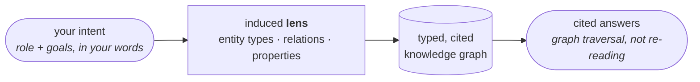

# Tantva

**Tell it what you want to ask. It designs the index.**

Tantva turns any corpus — code, contracts, novels, textbooks — into a typed, cited knowledge
graph shaped by your intent, then answers from the graph instead of re-reading.

---

## The central idea

Plain RAG chunks everything and hopes embeddings surface the answer. A general agent re-reads
the corpus on every question. Tantva takes a third path: first understand what the user wants to
ask, then design the index for it.

The **lens** is a per-corpus schema induced by the LLM from your stated intent and the
artifact's actual content. In practice: a user with a niche query pattern — a covenant reviewer,
an adaptation writer, an onboarding engineer — describes what they care about in plain words and
gets a retrieval system custom-built for that exact use case, on the fly, without needing to
know what RAG is. Same engine, same store, same query surface; the lens is the only thing that
changes:

| Who | Corpus | What the lens builds | What one call answers |
|---|---|---|---|
| Credit analyst | A credit agreement | • Every defined term, with its definition • Covenants and events of default • Links from each clause to the terms it relies on | "If this definition changes, what breaks?" |
| Screenwriter | A novel | • The cast, with each character's names merged into one entry • Scenes, and who appears together | "Who shares scenes with whom?" |
| Platform engineer | A multi-repo codebase | • A call graph per repo • The routes and queues that connect the repos | "Trace this event across the repos" |

Everything runs locally inside your Claude Code session — the engine makes zero model calls, so
there is no API key and your data stays on your machine. Every node and edge carries its
citation.

---

## Who it's for

**Broad on purpose.** Tantva isn't tuned to one domain — you tell Claude your niche, and it
custom-designs the index for exactly that use case. The same engine serves whoever shows up
next.

| Who | The problem | What Tantva does | Result from the evaluation |
|---|---|---|---|
| **Priya** — staff engineer onboarding to a multi-repo system | • The cross-repo picture isn't written down anywhere • Text search misses wiring that only exists at runtime (URLs built in code, queue names read from config) | • Indexes the repos once • Maps which service calls which route, and who produces and consumes each queue • One question returns the full path, cited file and line | • Traced an event five hops across three repos, every hop cited • Used 1 agent and ~63 tool calls; the same model reading from scratch used 39 agents and 818 |
| **Alex** — credit analyst reviewing a contract | • A credit agreement is a web of defined terms • Amending one definition silently changes ratios and limits elsewhere in the document | • Extracts every defined term and records which clauses rely on it • "What's affected if this changes" becomes a single lookup | • Found all 6 clauses relying on a changed term; the read-everything baseline found 3 • The baseline got the default-and-cure rules backwards; the graph got them right |
| **Sam** — screenwriter adapting a novel | • Characters go by several names (maiden name, married name, honorific) • Text search counts strings, not people, so casts and rankings come out wrong | • Builds the cast and scene graph • Merges each character's names into one entry, so counts and rankings are real | • Counted a family correctly (10–12 members) where the baseline string-counted 9 • Ranked first appearances by actual presence, not first mention |
| **Dr. Rao** — researcher in an unfamiliar domain | • The right way to index isn't known up front • Building a custom pipeline per domain is weeks of engineering | • You describe your role and goals • Tantva designs the schema for that domain, checks it against the material, and extracts into it | • 3 of 3 blind schema designs covered every must-have type, relation, and topic area in a hand-built rubric |
| **Maya** — documentation owner | • Docs go stale silently • Nothing connects what a doc claims to what the code does | • Links each doc claim to the code it describes, with a confidence score and source • Drift becomes a finding you can cite, not a surprise | • On the code corpus, drift questions were answered by pairing each doc claim with the code it describes, citing both sides — mismatches reported as findings, not repeated as truth |

---

## Scope

- **In scope:** any text-bearing corpus; lens induction from intent; deterministic + LLM
  extraction; entity resolution; persona-aware cited investigation; ingest-time wiki synthesis;
  a falsifiable eval program against a strong baseline.
- **Out of scope (v1):** non-text media; engine-internal model calls; real-time/streaming
  ingestion; multi-user serving. The engine targets a single analyst's Claude Code session.

## What's built

- **Engine** (`explainer-cli`): a local property-graph store where every node and edge carries
  its citation; deterministic extractors for structured artifacts; LLM-driven extraction for
  everything else; entity resolution. Exposed to Claude Code as ~25 MCP tools.
- **Skills**: the prompts that drive the pipeline — induce a lens from your intent, build the
  graph, investigate with citations, optionally synthesize a wiki. None are domain-specific;
  the lens carries all domain knowledge.
- **Evaluation**: 7 corpora, 140 verified questions, judged against a strong same-model
  baseline that reads the corpus directly. Tantva matches the baseline on accuracy overall and
  wins where the corpus has dense internal structure. Full results in
  [Problem, Data & Evaluation](evaluation).
